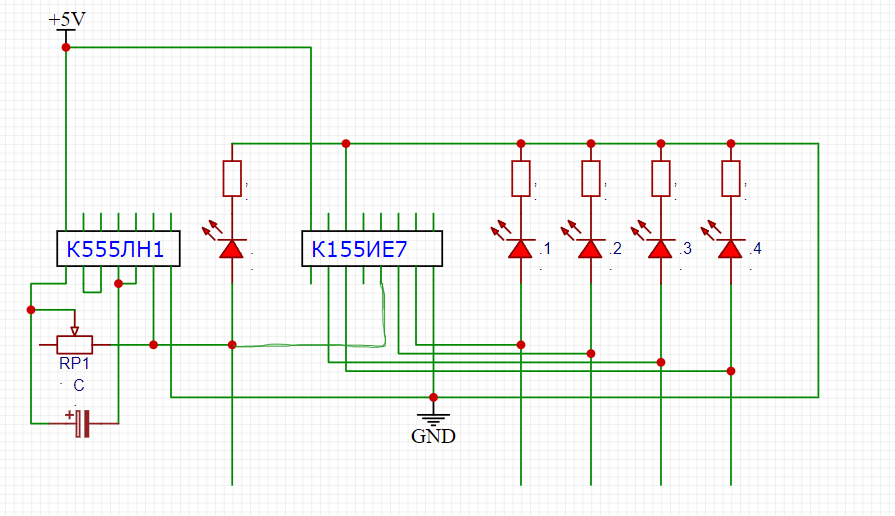

# Генератор импульсов и счётчик

**Что потребуется**:
  - К555ЛН1  1 шт
  - К155ИЕ7  1 шт
  - Резисторы 330 Ом  5 шт
  - Светодиоды  5 шт
  - Провода, макетная плата и питание

**Для чего нужен**:
------------------------------------------------------------------
Создание тактовой частоты и её изменение, а также перечисление всех адрессов памяти, которая в будущем будет использована
